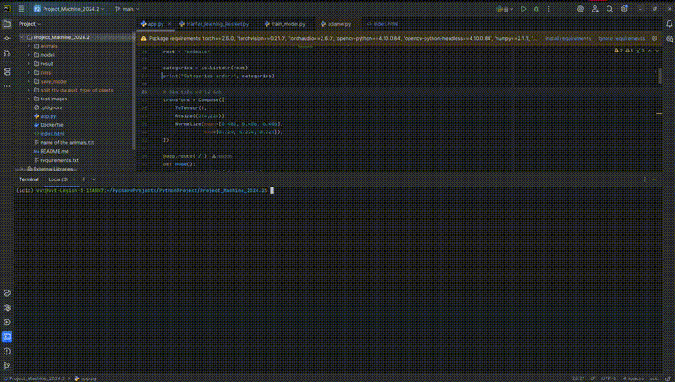

# Animal and Plant Classification

This repository contains a machine learning project aimed at classifying animals and plants into their respective categories using deep learning techniques. The project uses a pretrained model (ResNet) to classify 90 animal species and 40 plant species based on images.


## 🎥 Demo



## Table of Contents
- [Project Overview](#project-overview)
- [Dataset](#dataset)
- [Model](#model)
- [Installation](#installation)
- [Usage](#usage)
- [Results](#results)
- [License](#license)

## Project Overview

This project focuses on using deep learning techniques to classify images into two main categories:
- **Animals**: 90 species, with around 60 images per species.
- **Plants**: 40 species, with around 1000 images per species.

We use a pretrained ResNet model for transfer learning and fine-tune it on the specific dataset. The model is capable of classifying images with high accuracy, and it can be further improved with more training and hyperparameter tuning.

## Dataset

The dataset contains two categories:
1. **Animal Dataset**: Includes 90 species, each with around 60 images. You can download the animal image dataset from [Kaggle here](https://www.kaggle.com/datasets/iamsouravbanerjee/animal-image-dataset-90-different-animals?fbclid=IwZXh0bgNhZW0CMTEAAR0ySIR54WfGRIcGmXChwsUK6ubh56x2AfwhbR0G_OCybZ2Nwu62LsyQopo_aem_JZBy9FKiNqLniZFTuOjRHg).
2. **Plant Dataset**: Includes 40 species, each with around 1000 images.

The images have been preprocessed and divided into training and testing datasets to allow for model evaluation and validation.


## Model

We use a **ResNet** model, pretrained on ImageNet, for this classification task. Transfer learning is employed by fine-tuning the model's last few layers for our specific dataset.

### Steps Involved:
1. Load the pretrained ResNet model.
2. Freeze the initial layers and train the last few layers with the dataset.
3. Apply image augmentation and normalization to improve the model’s generalization.
4. Train the model using an appropriate optimizer and loss function.
5. Evaluate the model on a test set.

## Installation

To get started with this project, follow these steps to set up the environment:

1. Clone this repository:
   ```bash
   git clone https://github.com/ThanhhnanT/ML_20242_Classification-Images.gitProject_Machine_2024.2
   cd ML_20242_Classification-Images
2. Install package:
   ```bash
   pip install -r requirements.txt --extra-index-url https://download.pytorch.org/whl/cu126
3. Download checkpoint [here](https://drive.google.com/drive/folders/1gJBBemxc0vCnqhe69FtZ4jUpNTWXLXPT?usp=sharing)
4. Your structure folder like this:

      ML_20242_Classification-Images/

      │

      ├── animals/                                                        

      │   ├── species_1/xxx.jpeg

      │   ├── species_2/

      │   └── ...

      │

      ├── save_model/                                                         

      │   └── resnet_model.pth

      │

      ├── train_model.py                                                    


      ├── test_cnn.py                                                

      ├── transfer_learning_Resnet.py                                    

      │

      ├── download.jpeg                                                       

      └── README.md                                                            


## Run
   ```bash
   python test_cnn.py
